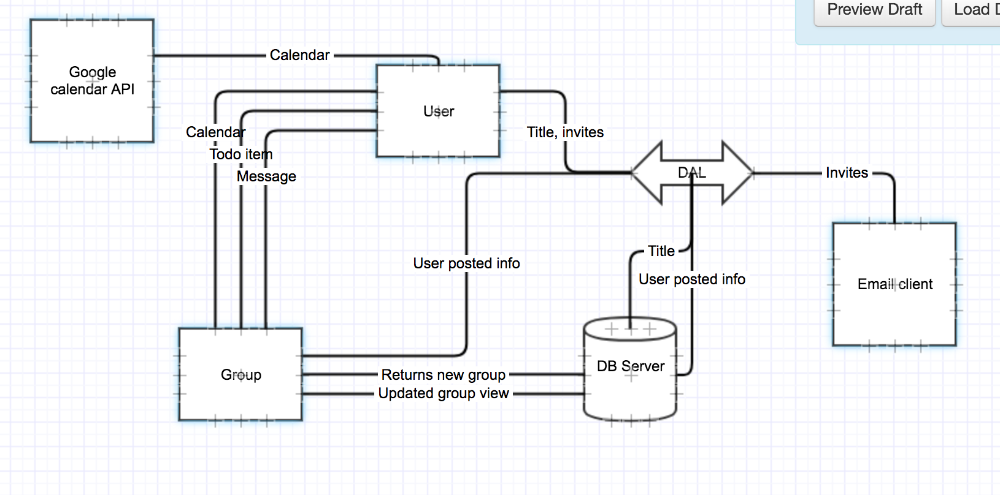
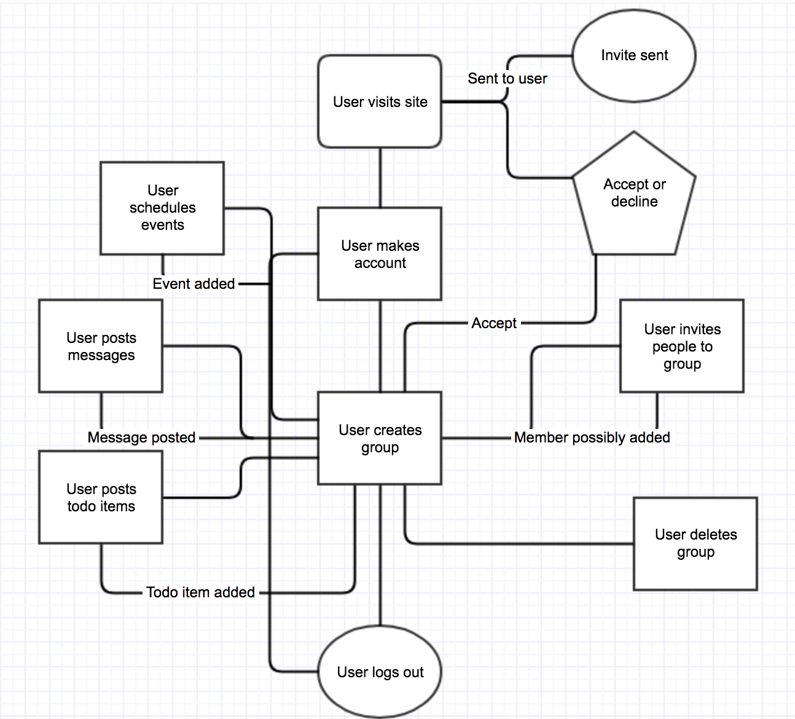

# Architecture
We will be using a client-server architecture. This will include three components: 
- Client (web browser)
- Server
- Database Server

## Client
This will be the front end UI. It will allow the user to retrieve information about
their groups and update information as well. This will be done through requests to the 
business logic server.

## Server
The server will be responsible for interfacing between the client and the data. It will
contain data cleaning and retrieval logic.

## Database
Our database will need hold user information like their credentials for login. It also
needs information about the groups a user is a part of. This includes the todo posts as well as scheduled events.

## Dataflow Diagram

## Sequence Diagram

